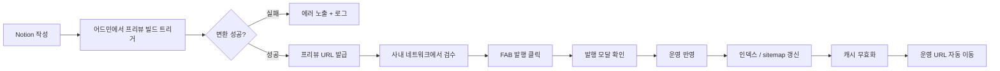
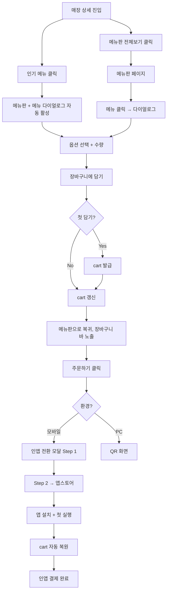

# 패스오더 프론트엔드 기획서 v0.3

본 문서는 두 영역의 페이지·플로우·요구사항을 정의합니다.

- **영역 1. 블로그 콘텐츠** — 인지·비교 단계 검색 의도를 흡수하는 콘텐츠 자산을 발행하고 인앱 전환의 톱-오브-퍼널로 활용합니다.
- **영역 2. 장바구니 전환** — 매장 상세부터 cart 조립, 인앱 전환까지의 동선을 신규 구축합니다.

본 문서는 화면 기획과 요구사항 정의에 집중합니다. 데이터 모델·API 스펙·렌더링 방식 등 기술 구현 명세는 별도 설계 문서에서 다룹니다. 일정·마일스톤·KPI·의사결정 히스토리 또한 별도 문서에서 관리합니다.

---

# 영역 1. 블로그 콘텐츠

## 1.1 개요

패스오더 플랫폼에 블로그 콘텐츠 자산을 신규로 도입합니다. 콘텐츠는 사내에서 이미 사용 중인 Notion으로 작성하고, 발행본은 자체 인프라에서 서빙합니다.

작성자는 Notion에서 글을 작성한 뒤, 어드민에서 프리뷰를 확인하고 명시적으로 발행을 트리거합니다. 자동 발행은 없습니다.

키워드 발굴 도구는 본 문서의 범위 밖입니다(별도 문서로 분리).

## 1.2 페이지 카탈로그

### 1.2.1 블로그 목록 `/blog`

| 항목 | 내용 |
| --- | --- |
| 경로 | `/blog`, `/blog?category={category}`, `/blog?page={n}` |
| 접근 권한 | 공개 |
| 색인 정책 | 색인 허용, sitemap 적재 |

**화면 구성**

- 헤더 영역: 페이지 타이틀, 카테고리 필터(칩 형태)
- 리스트 영역: 카드 그리드(데스크탑 3열, 태블릿 2열, 모바일 1열)
  - 카드 구성: 썸네일 / 카테고리 배지 / 타이틀(2줄 ellipsis) / 발행일 / 읽기 시간(분)
- 페이지네이션: 페이지당 20건, 숫자형 페이지네이션
- 빈 상태: 카테고리 필터 결과가 0건일 때 "조건에 맞는 글이 없습니다" 안내 + 필터 초기화 CTA

**상태 정의**

| 상태 | 처리 |
| --- | --- |
| 로딩 | 스켈레톤 카드 6개 표시 |
| 빈 결과 | 안내 문구 + 카테고리 필터 초기화 CTA |
| 에러 | 새로고침 CTA + 에러 코드 노출 |

**SEO 메타**

- 타이틀: `패스오더 블로그 | {카테고리명}`
- 메타 description: 카테고리 요약 + 최신 글 N건 타이틀 결합
- 구조화 데이터: `Blog`, `BreadcrumbList`
- 페이지네이션은 `rel="next" / rel="prev"` 명시

### 1.2.2 블로그 상세 `/blog/{slug}`

| 항목 | 내용 |
| --- | --- |
| 경로 | `/blog/{slug}` |
| 접근 권한 | 공개 |
| 색인 정책 | 색인 허용, canonical self |

**화면 구성**

- 상단: 카테고리 배지, 타이틀, 발행일, 작성자, 읽기 시간
- 본문: 표준 마크다운 + 본문 내 매장 카드 등 커스텀 요소
- 본문 이미지: lazy-load, 적정 사이즈로 최적화
- 하단: 관련 글 N건(같은 카테고리 최신순), 인앱 진입 CTA(전환 영역과 연계)
- 사이드(데스크탑 한정): 목차 자동 생성(h2/h3 추출), 스크롤 위치 하이라이트

**상태 정의**

| 상태 | 처리 |
| --- | --- |
| slug 미존재 | 404 페이지 |
| 발행 후 미반영 | 일정 시간 stale 허용, 발행 시 강제 무효화 |
| 본문 렌더 실패 | 본문 영역만 fallback, 헤더/하단은 정상 노출 |

**SEO 메타**

- 타이틀: `{글 타이틀} | 패스오더`
- 메타 description: 작성자가 입력한 요약, 미입력 시 본문 첫 160자
- OG 이미지: 썸네일 또는 본문 첫 이미지
- 구조화 데이터: `Article`

### 1.2.3 프리뷰 `/preview/{slug}`

| 항목 | 내용 |
| --- | --- |
| 경로 | `/preview/{slug}` |
| 접근 권한 | **사내 네트워크 한정** |
| 색인 정책 | `noindex, nofollow` (보조 안전장치) |

**화면 구성**

운영 페이지(`/blog/{slug}`)와 동일한 본문 표현을 사용하되 다음 차이만 둡니다.

- 상단 고정 배너: "미리보기 모드" 표시 + 빌드 시각 + Notion 페이지 링크
- 우하단 발행 버튼(FAB): "이 버전으로 발행하기" (클릭 시 발행 모달)
- 메타에 `noindex, nofollow` 적용

**발행 모달**

- 발행 대상 슬러그, 카테고리, 썸네일 미리보기
- 발행 후 영향(목록 갱신, sitemap 갱신, 캐시 무효화) 안내
- "발행" / "취소" CTA
- 발행 진행 상태 단계별 표시
- 실패 시 단계별 에러 노출 + 재시도 CTA

### 1.2.4 어드민 발행 콘솔 `/admin/blog`

| 항목 | 내용 |
| --- | --- |
| 경로 | `/admin/blog` |
| 접근 권한 | 사내 네트워크 + 어드민 인증 |
| 색인 정책 | `noindex` |

**화면 구성**

- Notion에서 동기화된 발행 후보 글 목록
  - 컬럼: 타이틀 / 슬러그 / 상태(Draft, Preview Built, Published) / 마지막 빌드 시각 / 액션
- 액션: `프리뷰 빌드`, `프리뷰 열기`, `발행`, `발행 취소`(롤백)
- 빌드 큐 상태 패널: 현재 빌드 중인 항목, 대기열, 최근 실패 5건
- 발행 이력 탭: 발행 시각 / 발행자 / 슬러그 / 결과

**상태 정의**

| 상태 | 처리 |
| --- | --- |
| Notion 동기화 실패 | 패널 상단에 에러 배너 + 재시도 CTA |
| 빌드 실패 | 해당 항목 상태 = Failed, 로그 링크 노출 |
| 권한 없음 | 어드민 로그인 페이지로 리다이렉트 |

## 1.3 사용자 플로우

### 1.3.1 작성 → 발행 플로우

### 1.3.2 단계별 실패 처리

| 단계 | 실패 케이스 | 처리 |
| --- | --- | --- |
| 변환 | Notion 블록 미지원, 이미지 다운로드 실패 | 빌드 실패 상태 + 어드민 로그 노출 |
| 운영 반영 | 인프라 오류 | 트랜잭션 롤백, 운영 영향 없음 |
| 인덱스 갱신 | 검색 인덱스 오류 | 발행은 유지, 인덱스만 재시도 큐로 |
| 캐시 무효화 | 일시 오류 | 발행은 유지, 일정 시간 stale 허용 후 자동 재시도 |

## 1.4 요구사항

### 1.4.1 기능 요구사항 (FR)

| ID | 요구사항 |
| --- | --- |
| FR-B-01 | 작성자는 어드민에서 프리뷰 빌드를 트리거할 수 있어야 합니다. |
| FR-B-02 | 프리뷰 페이지는 사내 네트워크에서만 접근 가능해야 합니다. |
| FR-B-03 | 모든 발행은 사람이 미리보기 확인 후 명시적으로 트리거해야 합니다. (자동 발행 금지) |
| FR-B-04 | 미리보기와 운영 발행은 동일한 변환 결과를 사용해야 합니다. |
| FR-B-05 | 발행은 운영 반영 / 인덱스 갱신 / 캐시 무효화의 단계로 구성되며, 각 단계 실패는 격리되어야 합니다. |
| FR-B-06 | 슬러그 중복 시 발행을 차단하고 사유를 노출해야 합니다. |
| FR-B-07 | 어드민에서 발행 이력 및 빌드 큐 상태를 조회할 수 있어야 합니다. |
| FR-B-08 | 본문 렌더 실패 시 본문 영역만 fallback 처리하고 페이지 전체가 깨지지 않아야 합니다. |

### 1.4.2 비기능 요구사항 (NFR)

| ID | 요구사항 |
| --- | --- |
| NFR-B-01 | 블로그 상세 페이지의 모바일 LCP 75p < 2.5s |
| NFR-B-02 | 발행 트리거 ~ 운영 노출 반영까지 < 60초 |
| NFR-B-03 | 프리뷰 URL은 메타 `noindex, nofollow` 및 인프라 IP 제한이 모두 적용되어야 합니다. |

## 1.5 추후 검토

- 다국어 슬러그 구조
- 예약 발행
- 발행 후 롤백
- 댓글 / 좋아요 등 사용자 인터랙션
- RSS / 사이트맵 자동 생성

---

# 영역 2. 장바구니 전환

## 2.1 개요

매장 상세에서 메뉴 클릭은 충분히 발생하지만 인앱 전환율은 베이스라인 0.67%에 머물러 있습니다. 본 영역은 매장 상세 UX를 개편하고, 메뉴판 페이지 + 장바구니 시스템을 신규로 구축하여, 유저가 "메뉴 조립 → 주문 직전"까지 웹에서 진행한 뒤 cart 상태를 그대로 인앱으로 전달하는 동선을 만듭니다.

기술 흐름(OneLink 딥링크 + 게스트 cart API)은 이미 준비되어 있으며, 본 영역의 진짜 과제는 **"장바구니까지 담았으나 앱을 설치하지 않고 이탈하는 유저"의 회수**입니다.

## 2.2 페이지 카탈로그

### 2.2.1 매장 상세 (개편) `/store/{storeId}`

| 항목 | 내용 |
| --- | --- |
| 경로 | `/store/{storeId}`, 기존 `?tab=*` 파라미터는 301 redirect |
| 접근 권한 | 공개 |
| 색인 정책 | 색인 허용, self-canonical |

**AS-IS / TO-BE**

| 구분 | AS-IS | TO-BE |
| --- | --- | --- |
| 구조 | 메뉴 / 소식 / 스토리 3개 탭 | 단일 스크롤, 영역 단위 구성 |

**TO-BE 화면 구성**

| 영역 | 뷰 형태 | 구성 | Anchor |
| --- | --- | --- | --- |
| 매장 헤더 | 고정 | 매장명 / 평점 / 영업상태 / 즐겨찾기 | — |
| 인기 메뉴 | 세로 리스트 | 자동 산출 N개 + "메뉴판 전체보기" CTA | `#menu` |
| 소식 | 가로 스크롤 | 진행중/예정 이벤트 카드 | `#news` |
| 스토리 | 가로 스크롤 | 매장 스토리 카드 3개 + "다른 매장 스토리" | `#story` |

**상태 정의**

| 상태 | 처리 |
| --- | --- |
| 인기 메뉴 0건 | "이 매장의 메뉴" 폴백 (메뉴 등록순) |
| 소식 0건 | 소식 영역 hide |
| 스토리 0건 | 스토리 영역 hide |
| 매장 미존재 | 404 |
| 매장 휴무 | 헤더에 "오늘 휴무" 배지, 메뉴는 노출하되 장바구니 담기 비활성 |

**인기 메뉴 산출 정책**

- 최근 30일 주문량 상위 N개를 노출합니다 (활성 메뉴 한정).
- 0건 매장은 "이 매장의 메뉴"(메뉴 등록순)로 폴백합니다.
- 정렬 가산점(신규 메뉴 등) 정책은 후속 결정합니다.

**SEO 메타**

- 메타 description: 매장 인기 메뉴 + 가격대 + 위치 요약
- 구조화 데이터: `Restaurant` + `Restaurant.hasMenu` + 영역별 `WebPageElement`
- jump-to-section: `#menu`, `#news`, `#story` 부여

### 2.2.2 매장 메뉴판 (신규) `/store/{storeId}/menu`

| 항목 | 내용 |
| --- | --- |
| 경로 | `/store/{storeId}/menu`, `/store/{storeId}/menu?category={cat}` |
| 접근 권한 | 공개 |
| 색인 정책 | 색인 허용, sitemap 적재 |

**진입 경로**

| 경로 | 설명 |
| --- | --- |
| 매장 상세 → "메뉴판 전체보기" CTA | 첫 카테고리부터 노출 |
| 매장 상세 → 인기 메뉴 카드 클릭 | 메뉴판 + 해당 메뉴 다이얼로그 자동 활성 |
| 검색 엔진 오가닉 유입 | `{매장명} 메뉴` 등 long-tail 키워드로 페이지 직접 진입 |
| 외부 링크 / SNS 공유 | URL 직접 진입 |

오가닉 유입은 본 페이지의 핵심 트래픽 채널입니다. 매장 상세를 거치지 않고 메뉴판이 첫 진입점이 되는 시나리오를 1급 사용 사례로 다룹니다 (헤더의 매장 요약, 매장 상세로의 명확한 링크, 단독으로도 충분한 매장 정보 노출).

**화면 구성 (상단부터)**

1. **매장 요약 헤더** — 뒤로가기 / 매장명 / 평점 / 영업상태 / 매장 상세로 이동 링크 (오가닉 유입 시 매장 컨텍스트 확보)
2. **카테고리 네비게이션** — 스티키, 가로 스크롤, 카테고리 점프 (스크롤 시 활성 카테고리 자동 하이라이트)
3. **카테고리별 메뉴 리스트** — 카테고리 헤더 + 메뉴 카드 (이미지·이름·설명·가격·인기/품절 배지)
4. **하단 고정 장바구니 바** — cart가 비어있으면 hide

**상태 정의**

| 상태 | 처리 |
| --- | --- |
| 메뉴 0건 매장 | 빈 상태 화면, "이 매장은 메뉴를 등록하지 않았어요" |
| 카테고리 필터 결과 0건 | 해당 카테고리만 hide, 다른 카테고리 정상 노출 |
| 매장 휴무 | 메뉴는 노출하되 "장바구니 담기" 버튼 비활성, 헤더 배지 노출 |
| 메뉴 품절 | 메뉴 카드에 "품절" 오버레이, 다이얼로그 진입 차단 |

**SEO 메타**

- 타이틀: `{매장명} 메뉴판 | 패스오더`
- 구조화 데이터: `Restaurant.hasMenu` 트리 (`Menu` → `MenuSection` → `MenuItem`)
- 메뉴 항목 권장 속성: 이름 / 설명 / 이미지 / 가격
- `BreadcrumbList`: 매장 → 메뉴판

### 2.2.3 메뉴 다이얼로그 `/store/{storeId}/menu/{menuId}`

| 항목 | 내용 |
| --- | --- |
| 경로 | `/store/{storeId}/menu/{menuId}` |
| 접근 권한 | 공개 |
| 색인 정책 | canonical은 메뉴판 본문(`/store/{storeId}/menu`)으로 통일 |

**화면 구성**

- 다이얼로그(데스크탑) / 풀스크린 시트(모바일)
- 상단: 메뉴 이미지(가로 스와이프 가능)
- 본문: 메뉴명 / 설명 / 가격 / 인기·품절 배지
- 옵션 영역
  - 필수 옵션 그룹: 단일 선택
  - 선택 옵션 그룹: 다중 선택 + 가격 가산 표시
- 수량 조절: −/+ 버튼 (최소 1, 최대는 매장 정책)
- 하단 고정: "장바구니에 담기 ({합산금액})" CTA

**상태 정의**

| 상태 | 처리 |
| --- | --- |
| 필수 옵션 미선택 | CTA 비활성, 누락 그룹 강조 |
| 메뉴 품절 | CTA 비활성 + "품절된 메뉴입니다" 안내 |
| 매장 휴무 | CTA 비활성 + "현재 주문할 수 없는 매장입니다" |
| 다른 매장 cart 존재 | 담기 클릭 시 "다른 매장의 장바구니가 있어요" 확인 모달 → 비우고 새로 시작 / 취소 |

### 2.2.4 인앱 전환 모달 (오버레이)

매장 메뉴판 또는 cart 진입 후 "주문하기" 클릭 시 노출됩니다. 2단계로 분리합니다.

**Step 1 — 주문 요약 + 설치 메리트**

- Cart 요약: 매장명, 메뉴 N개(이미지 + 이름 + 옵션 요약), 합계 금액
- 설치 시 받는 혜택: 첫 주문 할인, 적립금 등 (운영 정책)
- 설치 시간 기대치: "30초면 설치 완료"
- 신뢰 신호: 누적 이용자 수, 평점
- 보존 안내: "앱 설치 후에도 담은 메뉴는 그대로 유지돼요"
- CTA: `[앱 설치하고 결제]` (primary), `[닫기]` (secondary)

**Step 2 — 설치 후 자동 복원 안내**

- "설치 후 앱을 실행하면 담은 메뉴가 그대로 보여요" 안내
- 앱스토어 진입 (1.5초 카운트다운 후 자동 또는 즉시 CTA)

**상태 정의**

| 상태 | 처리 |
| --- | --- |
| Step 1 닫기 | 메뉴판으로 복귀, cart는 유지 |
| Step 2 앱스토어 이동 후 복귀 | cart 그대로 유지, 메뉴판 노출 |
| iOS / Android 분기 | 자동 분기 처리 |
| PC 접속 | 모달 대신 QR 코드 화면(2.2.5) 노출 |

### 2.2.5 PC 사용자 cart 이전 화면

| 항목 | 내용 |
| --- | --- |
| 트리거 | PC 환경에서 "주문하기" 클릭 |

**화면 구성**

- "휴대폰에서 결제를 이어서 진행해 주세요" 안내
- QR 코드 (cart 정보 포함)
- 카카오톡으로 보내기 / 링크 복사 CTA
- QR 만료 시각 표시 (기본 30분)

## 2.3 사용자 플로우

### 2.3.1 메뉴 담기 → 주문 → 인앱 전환

### 2.3.2 단계별 실패 / 이탈 처리

| 시점 | 이탈/실패 케이스 | 처리 |
| --- | --- | --- |
| cart 동기화 | 네트워크 오류 | 로컬 데이터 우선 표시, 백그라운드 재시도 |
| 인앱 전환 Step 1 | 닫기 | 메뉴판 복귀, cart 유지 |
| 인앱 전환 Step 2 | 앱 미설치 후 이탈 | 재방문 시 cart 자동 복원 + 인앱 전환 CTA 재노출 |
| 인앱 첫 실행 | cart 복원 실패 | 매장 페이지로 fallback + 에러 로깅 |
| PC 사용자 | 모바일 미이전 | QR 만료 30분, 재발급 가능 |

## 2.4 측정 설계

### 2.4.1 전환 퍼널 (8단계)

| 단계 | 정의 |
| --- | --- |
| ① | 매장 상세 진입 |
| ② | 인기 메뉴 클릭 |
| ③ | 메뉴판 페이지 진입 |
| ④ | 메뉴 다이얼로그 노출 |
| ⑤ | 장바구니 담기 (cart 발급) |
| ⑥ | 주문하기 클릭 |
| ⑦ | 인앱 cart 복원 성공 |
| ⑧ | 주문 완료 |

### 2.4.2 설치 게이트 보조 퍼널

| 단계 | 정의 |
| --- | --- |
| A | 주문하기 클릭 (전체) |
| B | 앱스토어 진입 |
| C | 앱 설치 완료 (미설치 유저 한정) |
| D | 인앱 첫 실행 + cart 복원 성공 |
| E | 인앱 주문 완료 |

핵심 지표: 설치 게이트 통과율 = C / (A 中 미설치 유저), 복원 성공률 = D / C, 설치 게이트 → 주문 완료 = E / A.

## 2.5 요구사항

### 2.5.1 기능 요구사항 (FR)

| ID | 요구사항 |
| --- | --- |
| FR-C-01 | 매장 상세는 단일 스크롤의 영역 단위 구성으로 노출되어야 합니다. |
| FR-C-02 | 첫 메뉴 담김 시점에 cart가 발급되어야 합니다. |
| FR-C-03 | cart는 메뉴 추가/삭제/옵션 변경 시 서버와 동기화되어야 합니다. |
| FR-C-04 | 페이지 재방문 / 디바이스 간 이동 시 cart가 복원되어야 합니다. |
| FR-C-05 | 1 cart = 1 매장 원칙을 유지합니다. 다른 매장의 메뉴 추가 시 사용자 확인을 거쳐야 합니다. |
| FR-C-06 | 인앱 전환 모달은 Step 1(요약 + 메리트)과 Step 2(설치 후 안내)로 분리되어야 합니다. |
| FR-C-07 | PC 환경에서 "주문하기" 클릭 시 cart 정보를 포함한 QR 코드 화면이 노출되어야 합니다. |
| FR-C-08 | 메뉴판 페이지는 검색 색인이 가능하며, 오가닉 유입 시 단독으로도 충분한 매장 컨텍스트를 제공해야 합니다. |
| FR-C-09 | 메뉴 다이얼로그 URL의 canonical은 메뉴판 본문 URL로 통일되어야 합니다. |
| FR-C-10 | 매장 상세의 기존 `?tab=*` URL은 단일 매장 상세 URL로 301 redirect 되어야 합니다. |
| FR-C-11 | 매장 휴무 / 메뉴 품절 시 장바구니 담기는 차단되어야 합니다. |

### 2.5.2 비기능 요구사항 (NFR)

| ID | 요구사항 |
| --- | --- |
| NFR-C-01 | 메뉴판 페이지의 모바일 LCP 75p < 2.5s |
| NFR-C-02 | 익명 cart 보존 기간 7일 |
| NFR-C-03 | 인앱 첫 실행 시 cart가 자동 복원되어야 합니다. |
| NFR-C-04 | 인기 메뉴는 일 1회 갱신됩니다. |

## 2.6 SEO 이행 체크리스트

수직 배치 전환 시 다음 항목이 함께 이행되어야 합니다.

**Core Web Vitals**

- 인기 메뉴 첫 N개는 우선 로드합니다.
- 소식 / 스토리 가로 스크롤 영역은 lazy-load 합니다.
- 본문 이미지는 webp + 적정 사이즈로 최적화합니다.

**카니발리제이션 방지 (매장 상세 ↔ 메뉴판)**

- 매장 상세는 인기 메뉴 N개 + 폴백까지, 메뉴판은 전체 메뉴 + 카테고리 / 옵션 / 가격까지로 의도 / 깊이를 차별화합니다.
- 매장 상세 → 메뉴판 anchor text는 "메뉴판 전체보기"로 통일합니다.
- 두 페이지 모두 self-canonical을 설정합니다.

**Anchor / jump-to-section**

- `#menu`, `#news`, `#story`를 부여합니다.
- 영역별 schema(`WebPageElement`)로 명시합니다.

**기존 탭 URL 처리**

- Search Console에서 `?tab=*` 색인 현황을 사전 확인합니다.
- 색인된 URL은 단일 매장 상세 URL로 301 redirect 합니다.

## 2.7 추후 검토

- **메뉴 판매 시간**: 메뉴별 판매 가능 시간(브레이크 타임 등) 매핑
- **옵션 복잡도**: 옵션 그룹 의존성, 옵션 가격 가산 규칙 정형화
- **장바구니 머지**: 비회원 cart ↔ 회원 cart 머지 정책, 충돌 시 우선순위
- **재고/품절**: 메뉴 품절 시 다이얼로그·장바구니 자동 제거 vs 알림
- **가격 변동**: 웹 담은 시점 ↔ 인앱 진입 시점 사이 가격 변동 정책
- **메뉴 다이얼로그 색인**: 색인 허용 vs canonical 통일
- **인앱 진입 후 결제 자동 진입 vs 사용자 확인**: A/B 결과에 따라 결정
- **미설치 유저 회수 채널**: 재방문 외에 활용 가능한 추가 회수 경로
