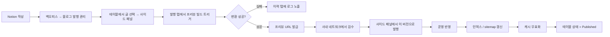
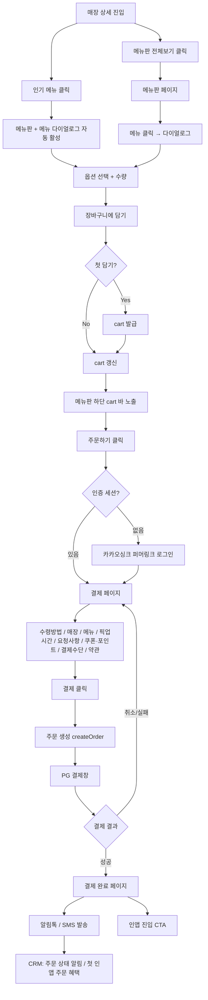
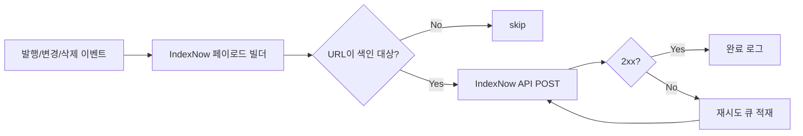

# 패스오더 프론트엔드 기획서 v0.4

본 문서는 두 영역의 페이지·플로우·요구사항을 정의합니다.

- **영역 1. 블로그 콘텐츠** — 인지·비교 단계 검색 의도를 흡수하는 콘텐츠 자산을 발행하고 인앱 전환의 톱-오브-퍼널로 활용합니다.
- **영역 2. 비회원 웹 결제** — 매장 상세부터 cart 조립, **웹에서의 비회원 결제 완료**까지의 동선을 신규 구축합니다. 인앱 전환은 결제 후 CRM 채널을 통해 소구합니다.
- **영역 3. SEO 인프라 개선** — 영역 1·2의 색인 효율을 끌어올리기 위해 IndexNow 연동, sitemap 최적화, 중복 색인 방지(쿼리 파라미터 canonical 정리)를 일괄 정비합니다.

본 문서는 화면 기획과 요구사항 정의에 집중합니다. 데이터 모델·API 스펙·렌더링 방식 등 기술 구현 명세는 별도 설계 문서에서 다룹니다. 일정·마일스톤·KPI·의사결정 히스토리 또한 별도 문서에서 관리합니다.

## v0.3 → v0.4 주요 변경

- 영역 2의 목표를 "웹 cart → 인앱 결제 전환"에서 "웹 cart → **비회원 웹 결제 완료**"로 변경했습니다.
  - 이유: cart 그대로 전환 구현은 공수가 크고 정책 충돌이 많으며, "결제는 앱에서" 허들이 전환율을 떨어뜨립니다.
  - 대안: 결제는 웹에서 마치고, 인앱 전환은 결제 직후 / 사후 CRM(주문 상태 알림 / 리텐션 채널)으로 소구합니다.
- 인앱 전환 모달(2단계) / PC QR cart 이전 화면을 제거하고, 다음 동선을 신규 추가했습니다.
  - 메뉴판 하단 cart 바의 **"주문하기"** 클릭 → **카카오싱크 퍼머링크 로그인**(인증 세션 없을 때) → **결제 페이지**(`/store/{storeId}/checkout`) → **PG 결제창** → **결제 완료**(`/checkout/complete`) → **주문 조회**(`/orders/{orderId}`)
- 결제 페이지부터 결제 완료·주문 조회까지는 **이미 운영 중인 같이주문(group-order) 웹 결제 플로우**를 그대로 재사용합니다(컴포넌트 / 훅 / `@common/payment-gateway` / 카카오싱크 식별자 체계 포함). 본 영역만의 차이는 그룹 주문 특유의 UI(참여자·호스트 리워드)를 hide 하는 정도로 한정합니다.

---

# 영역 1. 블로그 콘텐츠

## 1.1 개요

패스오더 플랫폼에 블로그 콘텐츠 자산을 신규로 도입합니다. 콘텐츠는 사내에서 이미 사용 중인 Notion으로 작성하고, 발행본은 자체 인프라에서 서빙합니다.

작성자는 Notion에서 글을 작성한 뒤, 어드민에서 프리뷰를 확인하고 명시적으로 발행을 트리거합니다. 자동 발행은 없습니다.

키워드 발굴 도구는 본 문서의 범위 밖입니다(별도 문서로 분리).

## 1.2 페이지 카탈로그

### 1.2.1 블로그 목록 `/blog`

| 항목 | 내용 |
| --- | --- |
| 경로 | `/blog`, `/blog?category={category}`, `/blog?page={n}` |
| 접근 권한 | 공개 |
| 색인 정책 | 색인 허용, sitemap 적재 |

**화면 구성**

- 헤더 영역: 페이지 타이틀, 카테고리 필터(칩 형태)
- 리스트 영역: 카드 그리드(데스크탑 3열, 태블릿 2열, 모바일 1열)
  - 카드 구성: 썸네일 / 카테고리 배지 / 타이틀(2줄 ellipsis) / 발행일 / 읽기 시간(분)
- 페이지네이션: 페이지당 20건, 숫자형 페이지네이션
- 빈 상태: 카테고리 필터 결과가 0건일 때 "조건에 맞는 글이 없습니다" 안내 + 필터 초기화 CTA

**상태 정의**

| 상태 | 처리 |
| --- | --- |
| 로딩 | 스켈레톤 카드 6개 표시 |
| 빈 결과 | 안내 문구 + 카테고리 필터 초기화 CTA |
| 에러 | 새로고침 CTA + 에러 코드 노출 |

**SEO 메타**

- 타이틀: `패스오더 블로그 | {카테고리명}`
- 메타 description: 카테고리 요약 + 최신 글 N건 타이틀 결합
- 구조화 데이터: `Blog`, `BreadcrumbList`
- 페이지네이션은 `rel="next" / rel="prev"` 명시

### 1.2.2 블로그 상세 `/blog/{slug}`

| 항목 | 내용 |
| --- | --- |
| 경로 | `/blog/{slug}` |
| 접근 권한 | 공개 |
| 색인 정책 | 색인 허용, canonical self |

**화면 구성**

- 상단: 카테고리 배지, 타이틀, 발행일, 작성자, 읽기 시간
- 본문: 표준 마크다운 + 본문 내 매장 카드 등 커스텀 요소
- 본문 이미지: lazy-load, 적정 사이즈로 최적화
- 하단: 관련 글 N건(같은 카테고리 최신순), 인앱 진입 CTA(전환 영역과 연계)
- 사이드(데스크탑 한정): 목차 자동 생성(h2/h3 추출), 스크롤 위치 하이라이트

**상태 정의**

| 상태 | 처리 |
| --- | --- |
| slug 미존재 | 404 페이지 |
| 발행 후 미반영 | 일정 시간 stale 허용, 발행 시 강제 무효화 |
| 본문 렌더 실패 | 본문 영역만 fallback, 헤더/하단은 정상 노출 |

**SEO 메타**

- 타이틀: `{글 타이틀} | 패스오더`
- 메타 description: 작성자가 입력한 요약, 미입력 시 본문 첫 160자
- OG 이미지: 썸네일 또는 본문 첫 이미지
- 구조화 데이터: `Article`

### 1.2.3 프리뷰 `/preview/{slug}`

| 항목 | 내용 |
| --- | --- |
| 경로 | `/preview/{slug}` |
| 접근 권한 | **사내 네트워크 한정** |
| 색인 정책 | `noindex, nofollow` (보조 안전장치) |

**화면 구성**

운영 페이지(`/blog/{slug}`)와 동일한 본문 표현을 사용하되 다음 차이만 둡니다.

- 상단 고정 배너: "미리보기 모드" 표시 + 빌드 시각 + Notion 페이지 링크 + 백오피스 사이드 패널로 돌아가기 링크
- 메타에 `noindex, nofollow` 적용

발행 액션은 본 페이지가 아니라 백오피스 블로그 발행 관리(1.2.4)의 사이드 패널에서 수행합니다.

### 1.2.4 백오피스 블로그 발행 관리

별도 어드민 앱을 신설하지 않고, 사내 백오피스(`backoffice-central` / `@service/partner-support`)에 신규 페이지로 추가합니다. 해당 백오피스의 표준 레이아웃인 **상단 필터 + 메인 테이블 + 우측 사이드 패널** 포맷을 그대로 따릅니다.

| 항목 | 내용 |
| --- | --- |
| 경로 | `/blog` (백오피스 내), 상세 선택 시 `?slug={slug}` 쿼리로 사이드 패널 활성 |
| 접근 권한 | 사내 백오피스 SSO + 블로그 권한 그룹 |
| 색인 정책 | 백오피스 전 페이지 공통 `noindex` |

**구현 표준 (재사용)**

- 사이드 패널: `packages/common-components/.../SidePage.component.tsx` (`SidePage.Container / Header(탭) / Main / Footer`)
- 사이드 패널 상태: `packages/common-atomics/.../SidePanel.atom.ts` + `useSidePage()` 훅
- 테이블: `packages/common-ui/src/components/table/*` (`TableRoot / TableRow / TableCell / TableHeader / TableToolbar`)
- 데이터: React Query InfiniteQuery + 변경 시 `queryClient.invalidateQueries`로 리스트 동기화
- URL 동기화: 라우트 push 없이 `useSearchParams()`로 선택 row(`slug`)를 쿼리에 보존

**상단 필터 영역**

| 필터 | 옵션 |
| --- | --- |
| 상태 | 전체 / Draft / Preview Built / Published / Failed |
| 카테고리 | 카테고리 다중 선택 |
| 작성자 | Notion 작성자 다중 선택 |
| 기간 | 마지막 빌드 시각 / 발행 시각 기준 범위 선택 |
| 키워드 | 타이틀 / 슬러그 부분 검색 |

**메인 테이블 컬럼**

| 컬럼 | 설명 |
| --- | --- |
| 타이틀 | 클릭 시 사이드 패널 열기 |
| 슬러그 | 운영 URL 미리보기, 클릭 복사 |
| 상태 | Draft / Preview Built / Published / Failed (배지) |
| 카테고리 | 카테고리 칩 |
| 마지막 빌드 시각 | 상대 시간 표기 |
| 발행 시각 | 미발행이면 `—` |
| 30일 PV | Published 한정, 0건이면 `—` |
| 액션 (퀵) | `프리뷰 빌드` / `프리뷰 열기` / `발행` / `발행 취소` 중 현 상태에 유효한 액션만 노출 |

테이블 toolbar에는 "Notion 동기화 상태" 표시(마지막 동기화 시각 + 수동 재동기 버튼)와 빌드 큐 요약(진행중 N / 대기 N / 최근 실패 N — 클릭 시 큐 상세 시트 오픈)을 둡니다.

**사이드 패널 구성** (`SidePage.Header` 탭 기반)

| 탭 | 내용 |
| --- | --- |
| 개요 | 타이틀 / 슬러그 / 카테고리 / 작성자 / 상태 / 마지막 빌드 시각 / Notion 페이지 링크 / 썸네일 미리보기 |
| 발행 | 현재 상태에 따른 액션 — `프리뷰 빌드`, `프리뷰 열기`, `이 버전으로 발행`, `발행 취소`(롤백). 발행 시 영향(목록 갱신 / sitemap 갱신 / 캐시 무효화) 단계별 진행 표시 |
| 이력 | 빌드 / 발행 / 롤백 이력 타임라인 (시각 / 행위자 / 결과 / 로그 링크) |
| 성과 | Published 한정. 누적 PV / UV / 평균 체류 / 스크롤 깊이 / 인앱 진입 CTA 클릭 / CRM 채널별 유입 / 검색 유입 키워드 Top N. 기간 필터(7d / 30d / 전체) + CSV 내보내기 |

`SidePage.Footer`에는 우선순위 액션을 sticky로 배치합니다 (현 상태 기준 primary 1개 + secondary 1~2개, 예: Published → `발행 취소` / `성과 보기`).

**상태 정의**

| 상태 | 처리 |
| --- | --- |
| Notion 동기화 실패 | toolbar에 에러 배너 + 재시도 버튼 |
| 빌드 실패 | 해당 row 상태 = Failed, 사이드 패널 이력 탭에 로그 링크 |
| 슬러그 충돌 | 발행 액션 차단 + 사유(어떤 글이 점유 중인지) 노출 |
| 권한 없음 | 백오피스 공통 권한 거부 화면 |
| 성과 데이터 미수집 | 성과 탭에 "수집 대기" placeholder |

## 1.3 사용자 플로우

### 1.3.1 작성 → 발행 플로우

### 1.3.2 단계별 실패 처리

| 단계 | 실패 케이스 | 처리 |
| --- | --- | --- |
| 변환 | Notion 블록 미지원, 이미지 다운로드 실패 | 빌드 실패 상태 + 어드민 로그 노출 |
| 운영 반영 | 인프라 오류 | 트랜잭션 롤백, 운영 영향 없음 |
| 인덱스 갱신 | 검색 인덱스 오류 | 발행은 유지, 인덱스만 재시도 큐로 |
| 캐시 무효화 | 일시 오류 | 발행은 유지, 일정 시간 stale 허용 후 자동 재시도 |

## 1.4 요구사항

### 1.4.1 기능 요구사항 (FR)

| ID | 요구사항 |
| --- | --- |
| FR-B-01 | 작성자는 사내 백오피스의 블로그 발행 관리 페이지에서 프리뷰 빌드를 트리거할 수 있어야 합니다. |
| FR-B-02 | 프리뷰 페이지는 사내 네트워크에서만 접근 가능해야 합니다. |
| FR-B-03 | 모든 발행은 사람이 미리보기 확인 후 백오피스 사이드 패널에서 명시적으로 트리거해야 합니다. (자동 발행 금지) |
| FR-B-04 | 미리보기와 운영 발행은 동일한 변환 결과를 사용해야 합니다. |
| FR-B-05 | 발행은 운영 반영 / 인덱스 갱신 / 캐시 무효화의 단계로 구성되며, 각 단계 실패는 격리되어야 합니다. |
| FR-B-06 | 슬러그 중복 시 발행을 차단하고 사유를 노출해야 합니다. |
| FR-B-07 | 백오피스에서 빌드 / 발행 / 롤백 이력과 빌드 큐 상태를 조회할 수 있어야 합니다. |
| FR-B-08 | 본문 렌더 실패 시 본문 영역만 fallback 처리하고 페이지 전체가 깨지지 않아야 합니다. |
| FR-B-09 | Published 상태의 글은 백오피스 사이드 패널의 성과 탭에서 PV / UV / 체류 / 인앱 CTA 클릭 / 유입 채널 / 검색 키워드를 기간 필터로 조회할 수 있어야 합니다. |
| FR-B-10 | 백오피스 블로그 발행 관리 페이지는 사내 SSO + 블로그 권한 그룹으로 접근 제어되어야 합니다. |

### 1.4.2 비기능 요구사항 (NFR)

| ID | 요구사항 |
| --- | --- |
| NFR-B-01 | 블로그 상세 페이지의 모바일 LCP 75p < 2.5s |
| NFR-B-02 | 발행 트리거 ~ 운영 노출 반영까지 < 60초 |
| NFR-B-03 | 프리뷰 URL은 메타 `noindex, nofollow` 및 인프라 IP 제한이 모두 적용되어야 합니다. |

## 1.5 추후 검토

- 다국어 슬러그 구조
- 예약 발행
- 발행 후 롤백
- 댓글 / 좋아요 등 사용자 인터랙션
- RSS / 사이트맵 자동 생성

---

# 영역 2. 비회원 웹 결제

## 2.1 개요

매장 상세에서 메뉴 클릭은 충분히 발생하지만 인앱 전환율은 베이스라인 0.67%에 머물러 있습니다. 본 영역은 매장 상세 UX를 개편하고, 메뉴판 + 장바구니 + **비회원 결제** 페이지를 신규로 구축하여, 유저가 "메뉴 조립 → 주문 완료"까지 **웹 단독으로 완결**할 수 있도록 합니다.

### 인앱 전환 정책 변경 (v0.4)

이전 안(웹 cart → 인앱 결제 cart 그대로 전환)은 다음 문제로 폐기합니다.

- cart 상태(메뉴 / 옵션 / 가격 / 매장 정책) 일치 보장에 공수가 큽니다.
- 가격·재고·휴무 상태 변동 시 충돌 정책 정의가 무겁습니다.
- "결제는 앱에서"라는 허들이 전환율 자체를 낮춥니다.

대신 다음 정책을 채택합니다.

- 결제는 웹에서 비회원으로 완결합니다(`collecting-market` 비회원 결제 동선 재사용).
- 인앱 유도는 **결제 후** 다음 두 채널로 분리합니다.
  - **결제 완료 페이지의 인앱 진입 CTA**: 주문 상태 추적·재주문·적립 등 인앱 전용 가치 강조.
  - **CRM(Push / 알림톡 / SMS / 이메일)**: 주문 상태 알림과 첫 인앱 주문 혜택을 결제 직후·D+N 시점에 전송.

### 결제 시스템 재사용 — 같이주문(group-order) 웹 결제 플로우

본 영역의 결제 동선은 **이미 같이주문 도메인에서 운영 중인 웹 결제 플로우를 그대로 재사용**합니다 (`apps/passorder-web-app/src/domain/group-order/`). 별도 결제 시스템을 새로 구축하지 않습니다.

| 항목 | 재사용 자산 |
| --- | --- |
| 인증 | **카카오싱크 퍼머링크 로그인** (`packages/kakao-auth`의 `openKakaoPfLink()`). 결과로 `userIdentifier`(회원) 또는 `nonUserIdentifier`(카카오 Sync 게스트) 발급 — 결제·주문 조회 시 `X-User-Id` / `X-Non-User-Id` 헤더로 전달 |
| 결제 페이지 | `domain/group-order/pages/cart` — 수령방법 / 매장주소 / 주문상품 / 픽업시간 / 요청사항 / 포인트·쿠폰 / 결제수단 / 구매유의사항을 단일 페이지로 노출 |
| 결제 수단 컴포넌트 | `pages/cart/payment-method` (`PaymentMethodSection`) — 카카오페이 / 네이버페이(Card·Money·Points + 현금영수증) / 토스페이 / 페이코 / 삼성페이(iOS 제외) / 애플페이(Android 제외) / 카드(카드사 드롭다운) |
| 약관 / 안내 | `pages/cart/purchase-notice` (`PurchaseNoticeSection`) — 선택 PG에 따른 안내·약관 |
| 결제 게이트웨이 | `@common/payment-gateway` 파사드, KICC 기본, Toss SDK 지원 — `createPaymentGateway()` / `initiatePayment()` / `openPaymentWindow()` |
| 결제 흐름 훅 | `features/payment/hooks/usePaymentFlow.ts` (주문 생성 → PG 호출), `pages/cart/hooks/useCartPayment.ts` (cart 데이터 결합) |
| 결제 완료 | `pages/complete` (`GroupOrderCompletePage`) — 주문번호 / 메뉴 / 결제금액 / 진행상태 / 매장 위치 / 호스트용 리워드 배너 |
| 주문 조회 | `useOrderDetailQuery(orderIdentifier)` + 카카오 세션 매칭(`useCurrentParticipant`). 세션 만료 시 카카오싱크 재로그인 |

본 영역(매장 단독 주문)에서는 호스트/참여자 개념이 없으므로 그룹 주문 특유의 UI(참여자 목록, 호스트 리워드 등)는 단일 사용자 기준으로 단순화한 형태로만 재사용합니다.

## 2.2 페이지 카탈로그

### 2.2.1 매장 상세 (개편) `/store/{storeId}`

| 항목 | 내용 |
| --- | --- |
| 경로 | `/store/{storeId}`, 기존 `?tab=*` 파라미터는 301 redirect |
| 접근 권한 | 공개 |
| 색인 정책 | 색인 허용, self-canonical |

**AS-IS / TO-BE**

| 구분 | AS-IS | TO-BE |
| --- | --- | --- |
| 구조 | 메뉴 / 소식 / 스토리 3개 탭 | 단일 스크롤, 영역 단위 구성 |

**TO-BE 화면 구성**

| 영역 | 뷰 형태 | 구성 | Anchor |
| --- | --- | --- | --- |
| 매장 헤더 | 고정 | 매장명 / 평점 / 영업상태 / 즐겨찾기 | — |
| 인기 메뉴 | 세로 리스트 | 자동 산출 N개 + "메뉴판 전체보기" CTA | `#menu` |
| 소식 | 가로 스크롤 | 진행중/예정 이벤트 카드 | `#news` |
| 스토리 | 가로 스크롤 | 매장 스토리 카드 3개 + "다른 매장 스토리" | `#story` |

**상태 정의**

| 상태 | 처리 |
| --- | --- |
| 인기 메뉴 0건 | "이 매장의 메뉴" 폴백 (메뉴 등록순) |
| 소식 0건 | 소식 영역 hide |
| 스토리 0건 | 스토리 영역 hide |
| 매장 미존재 | 404 |
| 매장 휴무 | 헤더에 "오늘 휴무" 배지, 메뉴는 노출하되 장바구니 담기 비활성 |

**인기 메뉴 산출 정책**

- 최근 30일 주문량 상위 N개를 노출합니다 (활성 메뉴 한정).
- 0건 매장은 "이 매장의 메뉴"(메뉴 등록순)로 폴백합니다.
- 정렬 가산점(신규 메뉴 등) 정책은 후속 결정합니다.

**SEO 메타**

- 메타 description: 매장 인기 메뉴 + 가격대 + 위치 요약
- 구조화 데이터: `Restaurant` + `Restaurant.hasMenu` + 영역별 `WebPageElement`
- jump-to-section: `#menu`, `#news`, `#story` 부여

### 2.2.2 매장 메뉴판 (신규) `/store/{storeId}/menu`

| 항목 | 내용 |
| --- | --- |
| 경로 | `/store/{storeId}/menu`, `/store/{storeId}/menu?category={cat}` |
| 접근 권한 | 공개 |
| 색인 정책 | 색인 허용, sitemap 적재 |

**진입 경로**

| 경로 | 설명 |
| --- | --- |
| 매장 상세 → "메뉴판 전체보기" CTA | 첫 카테고리부터 노출 |
| 매장 상세 → 인기 메뉴 카드 클릭 | 메뉴판 + 해당 메뉴 다이얼로그 자동 활성 |
| 검색 엔진 오가닉 유입 | `{매장명} 메뉴` 등 long-tail 키워드로 페이지 직접 진입 |
| 외부 링크 / SNS 공유 | URL 직접 진입 |

오가닉 유입은 본 페이지의 핵심 트래픽 채널입니다. 매장 상세를 거치지 않고 메뉴판이 첫 진입점이 되는 시나리오를 1급 사용 사례로 다룹니다 (헤더의 매장 요약, 매장 상세로의 명확한 링크, 단독으로도 충분한 매장 정보 노출).

**화면 구성 (상단부터)**

1. **매장 요약 헤더** — 뒤로가기 / 매장명 / 평점 / 영업상태 / 매장 상세로 이동 링크
2. **카테고리 네비게이션** — 스티키, 가로 스크롤, 카테고리 점프 (스크롤 시 활성 카테고리 자동 하이라이트)
3. **카테고리별 메뉴 리스트** — 카테고리 헤더 + 메뉴 카드 (이미지·이름·설명·가격·인기/품절 배지)
4. **하단 고정 장바구니 바** — cart가 비어있으면 hide. 좌측에 메뉴 수·합계 금액, 우측에 **"주문하기"** CTA. 클릭 시 인증 분기(2.2.5)를 거쳐 결제 페이지(2.2.6)로 진입.

**상태 정의**

| 상태 | 처리 |
| --- | --- |
| 메뉴 0건 매장 | 빈 상태 화면, "이 매장은 메뉴를 등록하지 않았어요" |
| 카테고리 필터 결과 0건 | 해당 카테고리만 hide, 다른 카테고리 정상 노출 |
| 매장 휴무 | 메뉴는 노출하되 "장바구니 담기" 버튼 비활성, 헤더 배지 노출 |
| 메뉴 품절 | 메뉴 카드에 "품절" 오버레이, 다이얼로그 진입 차단 |

**SEO 메타**

- 타이틀: `{매장명} 메뉴판 | 패스오더`
- 구조화 데이터: `Restaurant.hasMenu` 트리 (`Menu` → `MenuSection` → `MenuItem`)
- 메뉴 항목 권장 속성: 이름 / 설명 / 이미지 / 가격
- `BreadcrumbList`: 매장 → 메뉴판

### 2.2.3 메뉴 다이얼로그 `/store/{storeId}/menu/{menuId}`

| 항목 | 내용 |
| --- | --- |
| 경로 | `/store/{storeId}/menu/{menuId}` |
| 접근 권한 | 공개 |
| 색인 정책 | canonical은 메뉴판 본문(`/store/{storeId}/menu`)으로 통일 |

**화면 구성**

- 다이얼로그(데스크탑) / 풀스크린 시트(모바일)
- 상단: 메뉴 이미지(가로 스와이프 가능)
- 본문: 메뉴명 / 설명 / 가격 / 인기·품절 배지
- 옵션 영역
  - 필수 옵션 그룹: 단일 선택
  - 선택 옵션 그룹: 다중 선택 + 가격 가산 표시
- 수량 조절: −/+ 버튼 (최소 1, 최대는 매장 정책)
- 하단 고정: "장바구니에 담기 ({합산금액})" CTA

**상태 정의**

| 상태 | 처리 |
| --- | --- |
| 필수 옵션 미선택 | CTA 비활성, 누락 그룹 강조 |
| 메뉴 품절 | CTA 비활성 + "품절된 메뉴입니다" 안내 |
| 매장 휴무 | CTA 비활성 + "현재 주문할 수 없는 매장입니다" |
| 다른 매장 cart 존재 | 담기 클릭 시 "다른 매장의 장바구니가 있어요" 확인 모달 → 비우고 새로 시작 / 취소 |

### 2.2.4 카카오싱크 퍼머링크 로그인 게이트

메뉴판 하단 "주문하기" 버튼을 누른 직후 인증 상태에 따라 분기됩니다. 같이주문의 `openKakaoPfLink()` 동선을 그대로 재사용하므로 별도 페이지 디자인 없이 카카오 OS 인증 시트가 호출됩니다.

| 항목 | 내용 |
| --- | --- |
| 트리거 | 메뉴판 하단 cart 바의 "주문하기" 클릭 |
| 동작 | 인증 세션(`userIdentifier` 또는 `nonUserIdentifier`)이 이미 있으면 즉시 결제 페이지(2.2.5)로 이동. 없으면 `openKakaoPfLink()` → 카카오싱크 퍼머링크 로그인 → 콜백 후 결제 페이지로 이동 |
| 결과 식별자 | 회원이면 `userIdentifier`, 신규/Sync 게스트면 `nonUserIdentifier` |
| 데이터 | 카카오싱크 동의 항목으로 이름·전화번호(필수), 이메일·생년월일(선택, 매장 정책) |
| 색인 정책 | `noindex` (인증 콜백 라우트 포함) |

**상태 정의**

| 상태 | 처리 |
| --- | --- |
| 카카오싱크 거부 / 약관 미동의 | 메뉴판으로 복귀, cart 유지, 토스트로 사유 안내 |
| 동일 휴대폰의 회원 계정 존재 | 카카오싱크 로직이 자동 매칭 → `userIdentifier`로 진입 |
| 카카오싱크 실패 | 에러 토스트 + 재시도 CTA |
| cart 만료 / 비어있음 | 메뉴판으로 redirect |

### 2.2.5 결제 페이지 `/store/{storeId}/checkout`

같이주문 `domain/group-order/pages/cart`의 단일-페이지 결제 화면을 그대로 차용합니다. cart 검토부터 PG 호출 직전까지의 모든 입력을 한 페이지에서 처리합니다. Figma 디자인(`13855:71829`)이 그대로 매핑됩니다.

| 항목 | 내용 |
| --- | --- |
| 경로 | `/store/{storeId}/checkout` |
| 접근 권한 | 카카오싱크 인증(`userIdentifier` 또는 `nonUserIdentifier`) 보유. 미보유 시 2.2.4로 redirect |
| 색인 정책 | `noindex` |

**화면 구성 (Figma Section 1~9, 같이주문 cart 페이지 구조와 1:1 대응)**

| 섹션 | 영역 | 구성 | 재사용 컴포넌트 |
| --- | --- | --- | --- |
| Appbar | 상단 고정 | 뒤로가기 / "주문서" 타이틀 | 공통 |
| Section 1 | 수령 방법 | 가져갈게요 / 먹고갈게요 (매장 정책 분기) | group-order cart `receive-method` |
| Section 2 | 매장 위치 | 지도 thumb + 매장명 + 주소 + 먹고갈게요 안내 | group-order cart `store-info` |
| Section 3 | 주문 상품 | 메뉴 카드 리스트(이미지·이름·옵션·단가·수량) + 메뉴 추가 / 수량 변경 / 삭제 | group-order cart `order-items` |
| Section 4 | 픽업 예약 시간 | 시간 칩 그리드(운영시간·조리시간 기반 산출) + 안내 박스 | group-order cart `pickup-time` |
| Section 5 | 요청사항 | 드롭다운 + "패스또 요청하기" 체크 + 자유 입력 | group-order cart `request-message` |
| Section 6 | 쿠폰 / 포인트 | 보유 쿠폰 / 포인트(회원만 노출, 비회원은 hide + "회원 가입 시 적립 가능" 안내) | group-order cart `point-coupon` |
| Section 7 | 결제 금액 | 주문 금액 / 쿠폰 할인 / 적립 예상 / **최종 결제 금액** | group-order cart `amount-summary` |
| Section 8 | 결제 수단 | 카카오페이 / 네이버페이(Card·Money·Points + 현금영수증) / 토스페이 / 페이코 / 삼성페이(iOS 제외) / 애플페이(Android 제외) / 카드(카드사 드롭다운) | `pages/cart/payment-method` (`PaymentMethodSection`, `NaverPayMethodSelector`, `CashReceiptSelector`) |
| Section 9 | 안내 + 약관 | 선택 PG에 따른 구매 유의사항 + 약관 토글 + "위 내용을 확인하였으며 결제에 동의합니다" 체크 | `pages/cart/purchase-notice` (`PurchaseNoticeSection`) |
| CTA | 하단 고정 | "{최종금액}원 결제" — 클릭 시 2.2.6 진행 | group-order cart payment CTA |

**비회원 / 회원 분기**

| 항목 | 비회원(`nonUserIdentifier`) | 회원(`userIdentifier`) |
| --- | --- | --- |
| 쿠폰 / 포인트 (Section 6) | hide | 노출 |
| 적립 안내 | "회원 가입 시 적립 가능" 노출 | 적립 예상금액 노출 |
| 주문 조회 | 카카오 세션 보유 동안 `useOrderDetailQuery` | 동일 |

**상태 정의**

| 상태 | 처리 |
| --- | --- |
| cart 비어있음 | 빈 상태 + "메뉴판으로 돌아가기" CTA |
| 매장 휴무 / 영업종료 | 결제 CTA 비활성 + 헤더 배지 + 안내 박스 |
| 메뉴 품절 발생 | 해당 메뉴 카드에 품절 표시 + "품절 메뉴 제거하기" CTA, 제거 전 결제 차단 |
| 가격 변동 감지 | 변동 항목 강조 + 변경 합계 재확인 모달 |
| 약관 / 픽업시간 / 결제수단 미입력 | 결제 CTA 비활성 + 해당 영역 강조 |

### 2.2.6 결제 진행 (PG 호출)

별도 화면이 아니라 결제 페이지(2.2.5)의 CTA 클릭 후 진행되는 처리 단계입니다. 같이주문의 `useCartPayment` → `usePaymentFlow` 흐름을 그대로 사용합니다.

**처리 흐름**

1. **주문 생성** — `paymentFlow.createOrder()` 호출. 입력: cart, 수령방법, 픽업시간, 요청사항, 결제수단, `userIdentifier` / `nonUserIdentifier`, 쿠폰·포인트(회원). 응답: `order.identifier`
2. **PG 호출** — `@common/payment-gateway`의 `gateway.initiatePayment()` + `openPaymentWindow()`. 기본 PG는 KICC, 결제수단별 매핑은 `payment-utils`/`gateway-config`
3. **결제창 진입** — 카카오페이/네이버페이/토스페이 등 외부 결제 앱 또는 카드 결제 시트
4. **콜백** — 성공 시 `/complete`로 redirect, 실패 시 `?code=...&msg=...` 쿼리로 결제 페이지 복귀

**상태 정의**

| 상태 | 처리 |
| --- | --- |
| 주문 생성 실패 | 결제 페이지 유지 + 에러 토스트 |
| 결제창 사용자 취소 | cart 유지, 안내 토스트 |
| PG 결제 실패 | 에러 코드 매핑 메시지 + 재시도 CTA |
| 결제 성공 후 서버 승인 실패 | 결제 자동 취소 트리거 + 결제 페이지 복귀 + 안내 |

### 2.2.7 결제 완료 `/store/{storeId}/checkout/complete?orderId=...`

같이주문 `pages/complete`의 `GroupOrderCompletePage`를 단일 사용자 시나리오로 단순화하여 재사용합니다 (참여자 / 호스트 리워드 영역 제거).

| 항목 | 내용 |
| --- | --- |
| 접근 권한 | 카카오 세션의 `userIdentifier` / `nonUserIdentifier`가 주문의 구매자와 일치해야 함. 불일치 시 매장 상세로 fallback |
| 색인 정책 | `noindex` |

**화면 구성**

- 헤더: "주문이 접수되었어요" + 매장명 + 픽업 시간
- 주문 요약: 주문번호 / 메뉴 / 결제수단 / 결제금액
- 진행 상태 트래커 (접수 → 준비중 → 준비완료)
- 매장 위치 (먹고갈게요 / 가져갈게요 표시)
- **인앱 진입 CTA (주력)**: "패스오더 앱에서 주문 상태 확인하기" (OneLink 딥링크, 첫 인앱 주문 혜택 강조)
- 보조 CTA: "주문 내역 다시 보기" → 2.2.8
- 알림 수신 안내: 카카오싱크 시 받은 휴대폰으로 알림톡 / SMS 푸시

**상태 정의**

| 상태 | 처리 |
| --- | --- |
| 세션 식별자 불일치 | 매장 상세로 redirect |
| 주문 미존재 | 404 안내 |
| 매장 측 주문 거절 | 거절 안내 + 환불 진행 상태 + 고객센터 안내 |
| `?code=...&msg=...` 쿼리(결제 실패) | 에러 다이얼로그 + 결제 페이지로 돌아가기 CTA |

### 2.2.8 주문 조회 `/orders/{orderId}`

같이주문의 `useOrderDetailQuery` + `useCurrentParticipant` 패턴을 그대로 사용합니다. 카카오 세션이 살아있는 동안 사용자가 자신의 주문 상태를 다시 볼 수 있는 entry point입니다.

| 항목 | 내용 |
| --- | --- |
| 경로 | `/orders/{orderId}` |
| 접근 권한 | 카카오 세션의 `userIdentifier` / `nonUserIdentifier`가 주문 구매자와 일치 |
| 색인 정책 | `noindex` |

**화면 구성**

- 2.2.7과 동일한 주문 상세 카드 + 진행 상태 + 매장 위치
- 알림톡 / SMS의 "주문 상태 보기" 링크는 본 페이지로 deep-link

**상태 정의**

| 상태 | 처리 |
| --- | --- |
| 카카오 세션 만료 | `openKakaoPfLink()` 재호출 → 동일 휴대폰 매칭 시 자동 진입 |
| 식별자 불일치 | "주문을 찾을 수 없어요" + 홈으로 |
| 주문 미존재 | 404 |

## 2.3 사용자 플로우

### 2.3.1 메뉴 담기 → 비회원 결제 완료

### 2.3.2 단계별 실패 / 이탈 처리

| 시점 | 이탈/실패 케이스 | 처리 |
| --- | --- | --- |
| cart 동기화 | 네트워크 오류 | 로컬 데이터 우선 표시, 백그라운드 재시도 |
| 주문하기 클릭 | 카카오싱크 거부 / 약관 미동의 | 메뉴판 복귀, cart 유지, 토스트 안내 |
| 결제 페이지 | 가격·재고·휴무 변경 감지 | 변경 항목 강조 + 사용자 재확인 모달 |
| PG 호출 | 사용자 취소 | 결제 페이지 유지, 토스트 안내 |
| PG 호출 | 결제 실패 | 에러 코드 매핑 메시지 + 재시도 |
| PG 호출 | 서버 승인 실패 | 결제 자동 취소 + 결제 페이지 복귀 |
| 결제 완료 후 | 페이지 이탈 | 알림톡 / SMS의 주문 상태 링크로 재진입 (2.2.8) |
| 카카오 세션 만료 | 주문 조회 시 | `openKakaoPfLink()` 재호출 → 동일 휴대폰 자동 매칭 |
| 인앱 전환 | 결제 완료 페이지 CTA 미클릭 | CRM 채널(D+0 / D+1 / D+7)로 인앱 첫 주문 혜택 소구 |

## 2.4 측정 설계

### 2.4.1 전환 퍼널 (웹 결제 단독 완결)

| 단계 | 정의 |
| --- | --- |
| ① | 매장 상세 진입 |
| ② | 인기 메뉴 클릭 |
| ③ | 메뉴판 페이지 진입 |
| ④ | 메뉴 다이얼로그 노출 |
| ⑤ | 장바구니 담기 (cart 발급) |
| ⑥ | 주문하기 클릭 |
| ⑦ | 카카오싱크 인증 완료 (이미 세션 보유 시 자동 통과) |
| ⑧ | 결제 페이지 진입 |
| ⑨ | PG 결제창 진입 (createOrder 성공 + initiatePayment) |
| ⑩ | **웹 결제 완료** |

핵심 지표: **웹 결제 완료율 = ⑩ / ①**, 카카오싱크 통과율 = ⑦ / ⑥, 결제창 진입 후 완료율 = ⑩ / ⑨.

### 2.4.2 사후 인앱 전환 보조 퍼널

| 단계 | 정의 |
| --- | --- |
| α | 웹 결제 완료(⑩)와 동일 |
| β | 결제 완료 페이지 인앱 CTA 클릭 / CRM 메시지 클릭 |
| γ | 앱 설치 (미설치 유저 한정) |
| δ | 인앱 첫 실행 |
| ε | 인앱 첫 주문 완료 |

핵심 지표: 즉시 전환율 = β(즉시) / α, 7일 누적 인앱 첫 주문율 = ε(D+7) / α.

## 2.5 요구사항

### 2.5.1 기능 요구사항 (FR)

| ID | 요구사항 |
| --- | --- |
| FR-C-01 | 매장 상세는 단일 스크롤의 영역 단위 구성으로 노출되어야 합니다. |
| FR-C-02 | 첫 메뉴 담김 시점에 cart가 발급되어야 합니다. |
| FR-C-03 | cart는 메뉴 추가/삭제/옵션 변경 시 서버와 동기화되어야 합니다. |
| FR-C-04 | 페이지 재방문 / 디바이스 간 이동 시 cart가 복원되어야 합니다. |
| FR-C-05 | 1 cart = 1 매장 원칙을 유지합니다. 다른 매장의 메뉴 추가 시 사용자 확인을 거쳐야 합니다. |
| FR-C-06 | 메뉴판 하단 cart 바의 "주문하기" 클릭 시 인증 세션이 없으면 카카오싱크 퍼머링크 로그인을 호출하고, 콜백 후 결제 페이지로 진입해야 합니다. |
| FR-C-07 | 인증 결과는 회원이면 `userIdentifier`, 신규/Sync 게스트면 `nonUserIdentifier`로 받아 결제·주문조회 API에 `X-User-Id` / `X-Non-User-Id` 헤더로 전달되어야 합니다. |
| FR-C-08 | 결제 페이지는 같이주문(group-order) cart 페이지의 컴포넌트(`PaymentMethodSection` / `PurchaseNoticeSection` 등)를 그대로 재사용하며, 수령방법·매장·메뉴·픽업시간·요청사항·쿠폰/포인트·결제수단·약관을 단일 페이지로 처리해야 합니다. |
| FR-C-09 | 결제는 같이주문의 `useCartPayment` → `usePaymentFlow` 흐름을 그대로 사용하며 `@common/payment-gateway`를 통해 카카오페이 / 네이버페이(Card·Money·Points + 현금영수증) / 토스페이 / 페이코 / 삼성페이(iOS 제외) / 애플페이(Android 제외) / 카드를 지원해야 합니다. |
| FR-C-10 | 결제 약관 및 구매 유의사항 미동의 시 결제 CTA가 활성화되지 않아야 합니다. |
| FR-C-11 | 결제 완료 페이지는 같이주문 `pages/complete`의 컴포넌트를 단일 사용자 시나리오로 재사용하며, 인앱 진입 CTA를 노출하고 알림톡 / SMS를 발송해야 합니다. |
| FR-C-12 | 주문 조회는 카카오 세션의 `userIdentifier` / `nonUserIdentifier`로 인증되며, 세션 만료 시 카카오싱크 재호출(`openKakaoPfLink()`)로 동일 휴대폰 매칭이 가능해야 합니다. |
| FR-C-13 | 메뉴판 페이지는 검색 색인이 가능하며, 오가닉 유입 시 단독으로도 충분한 매장 컨텍스트를 제공해야 합니다. |
| FR-C-14 | 메뉴 다이얼로그 URL의 canonical은 메뉴판 본문 URL로 통일되어야 합니다. |
| FR-C-15 | 매장 상세의 기존 `?tab=*` URL은 단일 매장 상세 URL로 301 redirect 되어야 합니다. |
| FR-C-16 | 매장 휴무 / 메뉴 품절 시 장바구니 담기 및 결제는 차단되어야 합니다. |
| FR-C-17 | 결제 페이지에서 가격·재고·휴무 변동이 감지되면 사용자에게 재확인을 요구해야 합니다. |

### 2.5.2 비기능 요구사항 (NFR)

| ID | 요구사항 |
| --- | --- |
| NFR-C-01 | 메뉴판 페이지의 모바일 LCP 75p < 2.5s |
| NFR-C-02 | 익명 cart 보존 기간 7일 |
| NFR-C-03 | 결제는 PCI-DSS / 전자금융 컴플라이언스를 충족하는 결제 대행(KICC / Toss 등 `@common/payment-gateway` 지원 PG)을 통해서만 처리하며, 카드 정보는 자체 저장하지 않습니다. |
| NFR-C-04 | 인기 메뉴는 일 1회 갱신됩니다. |
| NFR-C-05 | 결제 완료 ~ 알림톡 / SMS 발송까지 < 30초 |
| NFR-C-06 | 결제 완료 / 주문 조회 페이지의 접근은 카카오 세션의 `userIdentifier` 또는 `nonUserIdentifier`가 주문 구매자와 일치하는지 검증해야 합니다. |
| NFR-C-07 | 결제 페이지·결제 완료·주문 조회는 같이주문 도메인과 동일한 컴포넌트·훅·게이트웨이 파사드를 사용하며, 본 영역만의 분기는 group-order 특유의 UI(참여자·호스트 리워드)를 hide 하는 데 한정합니다. |

## 2.6 SEO 이행 체크리스트

수직 배치 전환 시 다음 항목이 함께 이행되어야 합니다.

**Core Web Vitals**

- 인기 메뉴 첫 N개는 우선 로드합니다.
- 소식 / 스토리 가로 스크롤 영역은 lazy-load 합니다.
- 본문 이미지는 webp + 적정 사이즈로 최적화합니다.

**카니발리제이션 방지 (매장 상세 ↔ 메뉴판)**

- 매장 상세는 인기 메뉴 N개 + 폴백까지, 메뉴판은 전체 메뉴 + 카테고리 / 옵션 / 가격까지로 의도 / 깊이를 차별화합니다.
- 매장 상세 → 메뉴판 anchor text는 "메뉴판 전체보기"로 통일합니다.
- 두 페이지 모두 self-canonical을 설정합니다.

**Anchor / jump-to-section**

- `#menu`, `#news`, `#story`를 부여합니다.
- 영역별 schema(`WebPageElement`)로 명시합니다.

**기존 탭 URL 처리**

- Search Console에서 `?tab=*` 색인 현황을 사전 확인합니다.
- 색인된 URL은 단일 매장 상세 URL로 301 redirect 합니다.

**비결제 페이지의 색인 분리**

- 장바구니 / 본인확인 / 결제 / 결제완료 / 주문조회 페이지는 모두 `noindex`.

## 2.7 추후 검토

- **회원 / 비회원 cart 머지 정책**: 카카오싱크 시 동일 휴대폰의 회원 계정이 발견되어 `userIdentifier`로 변환되었을 때, 기존 비회원 cart의 처리 방식
- **그룹 주문 컴포넌트 분기 비용**: 같이주문 cart 페이지 컴포넌트를 단일 사용자용으로 hide 처리할 때 group-order 도메인 코드를 그대로 가져갈지, 본 도메인으로 추출할지
- **메뉴 판매 시간**: 메뉴별 판매 가능 시간(브레이크 타임 등) 매핑
- **옵션 복잡도**: 옵션 그룹 의존성, 옵션 가격 가산 규칙 정형화
- **재고/품절**: 메뉴 품절 시 장바구니 자동 제거 vs 알림 + 사용자 제거
- **가격 변동 정책**: 담은 시점 ↔ 결제 시점 사이 가격 변동 시 재확인 / 자동 갱신 / 차단 중 어디까지 허용할지
- **메뉴 다이얼로그 색인**: 색인 허용 vs canonical 통일
- **결제 후 인앱 유도 강도**: 자동 딥링크 시도 vs CTA-only — A/B 결과로 결정
- **CRM 메시지 시퀀스**: 결제 직후 / D+1 / D+7 메시지 카피와 채널 우선순위
- **PC 사용자 경험**: 결제 자체는 PC에서도 가능. 픽업 매장 정보 / QR 활용은 별도 검토.
- **반복 비회원 식별**: 동일 휴대폰으로 N차 결제 시 자동 인식 / 회원 가입 유도 시점

---

# 영역 3. SEO 인프라 개선

## 3.1 개요

영역 1(블로그)과 영역 2(매장 상세 / 메뉴판)에서 신규로 발행되는 색인 대상 페이지가 빠르게 늘어나는 상황에서, 검색엔진의 발견·갱신·중복 처리 효율을 끌어올리기 위해 SEO 인프라를 일괄 정비합니다. 본 영역은 신규 사용자 화면을 추가하지 않으며, 발행·배포 파이프라인과 응답 헤더·메타·sitemap 산출 로직을 손봅니다.

다음 세 가지를 본 영역의 범위로 둡니다.

1. **IndexNow 연동** — 페이지 신규/변경/삭제 시점에 검색엔진(IndexNow 프로토콜 지원)에 즉시 통보
2. **sitemap 최적화** — sitemap을 `.xml.gz`로 압축 서빙하고, 매장 메뉴판 페이지를 sitemap에 자동 포함
3. **page 쿼리 파라미터 제거** — 페이지네이션 URL을 별도 색인 대상에서 제외하여 중복·저품질 색인을 차단
4. **매장 채널 홍보 링크 전환** — 네이버 플레이스 등 매장 외부 채널의 랜딩 URL을 자체 매장 상세(`/store/{storeId}`)로 교체하여 백링크 확보 + 패스오더 유입 + 결제 전환까지 잇기

## 3.2 작업 카탈로그

### 3.2.1 IndexNow 연동

| 항목 | 내용 |
| --- | --- |
| 프로토콜 | [IndexNow](https://www.indexnow.org/) (Bing / Yandex / Naver 등 참여 검색엔진 공통 엔드포인트) |
| 트리거 | 색인 대상 URL의 신규 발행 / 본문·메타 변경 / 삭제 / 슬러그 변경 |
| 호출 시점 | 영역 1 발행 파이프라인의 "인덱스 갱신" 단계(1.3.1 J 노드) 및 영역 2의 매장·메뉴 변경 이벤트 후 |
| 키 관리 | 도메인 루트에 `{key}.txt` 정적 호스팅, 키 회전은 인프라 시크릿으로 관리 |
| 색인 대상 | `/blog/{slug}`, `/blog`(목록), `/store/{storeId}`, `/store/{storeId}/menu` |
| 색인 제외 | `noindex` 처리되는 모든 경로(체크아웃 / 결제 완료 / 주문 조회 / 프리뷰 / 인증 콜백) |

**호출 흐름**

**상태 정의**

| 상태 | 처리 |
| --- | --- |
| API 4xx (키 검증 실패 등) | 알림 + 재시도 중단, 키 점검 |
| API 5xx / 네트워크 오류 | 지수 백오프 재시도(최대 N회) 후 dead-letter |
| 페이로드 초과(URL 다수) | 청크 분할 전송 |
| 동일 URL 단시간 반복 변경 | 디바운스(예: 60초) 후 1회만 통보 |

**측정**

- 통보된 URL 수 / 성공률 / 재시도율
- 발행 → 검색엔진 색인 반영까지의 리드타임 변화(전·후 비교)

### 3.2.2 sitemap 최적화

#### (a) gzip 압축 서빙

| 항목 | 내용 |
| --- | --- |
| 변경 전 | `sitemap.xml` 단일 파일 평문 서빙 |
| 변경 후 | `sitemap.xml.gz` 압축본 업로드 + `robots.txt`의 `Sitemap:` 지시자도 `.gz` URL로 갱신 |
| 응답 | `Content-Type: application/xml`, `Content-Encoding: gzip` |
| 빌드 | sitemap 생성 파이프라인 말미에 gzip 인코딩 단계 추가, 무결성 체크섬 동시 산출 |

#### (b) 매장 메뉴판 sitemap 자동화

| 항목 | 내용 |
| --- | --- |
| 대상 URL | `/store/{storeId}/menu` (영역 2의 메뉴판 페이지) |
| 산출 소스 | 매장 / 메뉴 마스터에서 활성 상태(영업중·노출중) 매장 추출 |
| 분할 정책 | 단일 sitemap의 권장 한도(50,000 URL / 50MB)를 초과할 경우 sitemap index로 분할 |
| 갱신 주기 | 1일 1회 정기 + 매장 신규/폐점 등 큰 변경 시 즉시 트리거 |
| `lastmod` | 매장·메뉴의 마지막 변경 시각(또는 인기 메뉴 갱신 시각 중 더 최근) |
| 상호작용 | sitemap 갱신 직후 변경 URL은 3.2.1 IndexNow에도 통보 |

**상태 정의**

| 상태 | 처리 |
| --- | --- |
| 매장 / 메뉴 데이터 일시 조회 실패 | 직전 sitemap 유지, 알림 |
| 일부 매장만 추출 실패 | 부분 산출 + 실패 항목 재시도 큐 |
| URL 한도 초과 | sitemap index 자동 분할 |
| 비활성·휴업 매장 | sitemap에서 제외, 기존 색인은 자연 소거(필요 시 410) |

### 3.2.3 page 쿼리 파라미터 제거 (canonical 정책 변경)

| 항목 | 내용 |
| --- | --- |
| 대상 | `/blog?page={n}` 등 **페이지네이션 쿼리 파라미터가 붙은 URL** |
| AS-IS | 각 page 파라미터별 URL을 self-canonical로 두어 페이지 단위로 색인 가능 |
| TO-BE | page 파라미터가 붙은 URL의 canonical을 **page 파라미터를 제거한 정규 URL**로 통일 |
| 이유 | 페이지네이션 URL은 본문 컨텐츠가 사실상 카드 목록으로 중복되어 저품질·중복 색인 위험이 큼. 색인 가능 URL 수를 줄여 크롤 예산을 본문(상세)으로 집중 |
| 영향 범위 | 영역 1의 블로그 목록(`/blog`, `/blog?category=...`, `/blog?page=...`)이 1차 대상. 향후 다른 목록 페이지에도 동일 정책 적용 |

**메타 / 헤더 정책**

| URL 형태 | canonical | 색인 |
| --- | --- | --- |
| `/blog` | `/blog` | 색인 허용 |
| `/blog?category=foo` | `/blog?category=foo` | 색인 허용 |
| `/blog?page=2` | `/blog` | 색인 허용(canonical 통일) |
| `/blog?category=foo&page=2` | `/blog?category=foo` | 색인 허용(canonical 통일) |

> 1.2.1 블로그 목록의 SEO 메타 항목 중 "페이지네이션은 `rel=next / rel=prev` 명시"는 본 정책으로 대체합니다(canonical 통일이 우선).

**마이그레이션**

- Search Console에서 `?page=` 색인 현황 사전 확인
- canonical 변경 배포 → IndexNow로 변경 통보(3.2.1)
- sitemap에는 page 파라미터 URL을 포함하지 않음

### 3.2.4 매장 채널 홍보 링크 전환

| 항목 | 내용 |
| --- | --- |
| 배경 (AS-IS) | 매장 채널 홍보 프로젝트는 네이버 플레이스의 "주문/예약" 등 외부 링크 영역에 **별도 내부 랜딩 페이지**를 등록하여 운영 중. 랜딩은 매장 정보·메뉴 일부를 정적으로 보여주는 수준에 그쳐, 실제 결제까지 이어지지 못하고 SEO 관점에서도 유입을 흡수하지 못함 |
| 변경 (TO-BE) | 영역 2의 개편으로 **매장 상세(`/store/{storeId}`)와 메뉴판(`/store/{storeId}/menu`)이 단독 진입 페이지로 충분한 컨텍스트를 제공하고 비회원 웹 결제까지 완결**되므로, 외부 채널의 랜딩 URL을 매장 상세 / 메뉴판으로 일괄 교체 |
| 목적 | (a) 권위 있는 외부 채널(네이버 플레이스 등)에서 자체 도메인으로의 **백링크 확보**, (b) 외부 채널 트래픽을 **패스오더 매장 상세 → 메뉴판 → 비회원 웹 결제** 동선으로 흡수, (c) 검색 가시성·색인 신호 강화 |
| 1차 채널 | 네이버 플레이스 (스마트플레이스 "홈/메뉴/주문" 외부 링크 슬롯) |
| 후속 채널 | 카카오맵 / 구글 비즈니스 프로필 / 인스타그램 프로필 링크 / 매장 자체 SNS 등 매장이 운영 중인 모든 외부 채널 (운영 정책은 후속 결정) |

**랜딩 URL 매핑 정책**

| 외부 채널 슬롯 | TO-BE 랜딩 URL | 비고 |
| --- | --- | --- |
| "주문하기" / "메뉴" 류 슬롯 | `/store/{storeId}/menu?utm_source={channel}&utm_medium=referral&utm_campaign=store-channel` | 메뉴판이 결제 동선의 시작점이므로 우선 매핑 |
| "홈" / "매장 정보" 류 슬롯 | `/store/{storeId}?utm_source={channel}&utm_medium=referral&utm_campaign=store-channel` | 매장 상세로 매핑 |
| 기존 내부 랜딩 페이지 | `/store/{storeId}` 또는 `/store/{storeId}/menu`로 **301 redirect** | 누적된 외부 백링크 보존 |

- UTM 파라미터는 매장 상세 / 메뉴판의 canonical 정책에 영향을 주지 않습니다 (self-canonical 유지, UTM은 색인 시 제거).
- 채널별 식별을 위해 `utm_source`는 채널 코드(`naver-place`, `kakao-map` 등)로 표준화합니다.

**운영 / 적용 방식**

| 항목 | 내용 |
| --- | --- |
| 적용 주체 | 각 매장 운영자(가맹점주) — 본인 채널의 링크 변경 권한이 매장에 있음 |
| 지원 도구 | 매장 어드민(파트너 백오피스)에 매장별 권장 랜딩 URL을 노출하고 "복사" 버튼 제공. 채널별 가이드(네이버 플레이스 슬롯 위치 등) 동봉 |
| 일괄 안내 | 매장 운영팀이 가이드 + 매장별 URL을 일괄 발송 (이메일 / 알림톡), 적용 여부를 어드민에서 추적 |
| 적용 추적 | 매장 어드민에 "외부 채널 적용 상태" 표시 (채널별 적용/미적용/미확인). 적용 여부는 referrer 로그 + 매장 운영자 자가 체크로 판정 |

**측정**

- 채널별 referrer 유입 수 (`utm_source` 기준)
- 외부 채널 유입 → 매장 상세 / 메뉴판 → 결제 완료 전환율 (영역 2의 측정 퍼널과 결합)
- 매장별 외부 채널 적용률 (적용 매장 수 / 전체 매장 수)
- Search Console / Ahrefs 등에서 `passorder.com` 백링크 도메인 수 변화

**상태 정의**

| 상태 | 처리 |
| --- | --- |
| 매장 휴무 / 비활성 | 외부 링크는 유지하되 매장 상세 / 메뉴판에서 휴무 배지 + 결제 차단(영역 2의 정책 그대로) |
| 매장 폐점 | 매장 상세 페이지를 410 또는 안내 페이지로 응답, 매장 어드민에서 채널 링크 제거 가이드 |
| 외부 채널 적용 미진행 | 매장 어드민에서 미적용 매장 리스트 노출 + 재안내 트리거 |
| 매장ID / 슬러그 변경 | 기존 외부 링크가 가리키던 URL을 신규 URL로 301 redirect |

## 3.3 요구사항

### 3.3.1 기능 요구사항 (FR)

| ID | 요구사항 |
| --- | --- |
| FR-S-01 | 색인 대상 URL의 신규/변경/삭제 시 IndexNow API로 통보해야 합니다. |
| FR-S-02 | IndexNow 통보는 영역 1의 발행 파이프라인 "인덱스 갱신" 단계 및 영역 2의 매장/메뉴 변경 이벤트와 연계되어야 합니다. |
| FR-S-03 | `noindex` 처리되는 경로는 IndexNow 통보 대상에서 제외되어야 합니다. |
| FR-S-04 | IndexNow 호출 실패 시 지수 백오프 재시도 후 dead-letter 큐로 적재되어야 합니다. |
| FR-S-05 | sitemap은 gzip 압축본(`.xml.gz`)으로 서빙되어야 하며 `robots.txt`의 `Sitemap:` 지시자도 동일 URL을 가리켜야 합니다. |
| FR-S-06 | 활성 상태의 모든 매장 메뉴판 페이지(`/store/{storeId}/menu`)가 sitemap에 자동 포함되어야 합니다. |
| FR-S-07 | sitemap이 단일 파일 권장 한도를 초과하면 sitemap index로 분할되어야 합니다. |
| FR-S-08 | 매장/메뉴 변동 시 해당 URL은 sitemap 재생성 + IndexNow 통보가 함께 트리거되어야 합니다. |
| FR-S-09 | 페이지네이션 쿼리 파라미터(`?page={n}`)가 붙은 URL의 canonical은 page 파라미터를 제거한 URL이어야 합니다. |
| FR-S-10 | sitemap에는 page 파라미터가 붙은 URL을 포함하지 않아야 합니다. |
| FR-S-11 | 매장 채널 홍보의 외부 채널 랜딩 URL은 자체 매장 상세(`/store/{storeId}`) 또는 메뉴판(`/store/{storeId}/menu`)으로 매핑되어야 하며, 기존 내부 랜딩 페이지 URL은 신규 URL로 301 redirect 되어야 합니다. |
| FR-S-12 | 매장 어드민에서 매장 운영자가 본인 매장의 외부 채널용 권장 랜딩 URL을 채널별로 조회·복사할 수 있어야 하며, UTM 파라미터(`utm_source` / `utm_medium=referral` / `utm_campaign=store-channel`)가 자동 부여되어야 합니다. |
| FR-S-13 | 외부 채널 referrer 유입은 채널별로 구분 측정되어야 하며, 영역 2의 결제 전환 퍼널과 결합 분석 가능해야 합니다. |
| FR-S-14 | UTM 파라미터가 부여된 URL의 canonical은 UTM을 제거한 정규 URL로 통일되어야 합니다. |

### 3.3.2 비기능 요구사항 (NFR)

| ID | 요구사항 |
| --- | --- |
| NFR-S-01 | IndexNow 통보 호출은 발행/변경 이벤트 발생 후 60초 이내에 시작되어야 합니다. |
| NFR-S-02 | 동일 URL의 단시간(60초 내) 반복 변경은 디바운스되어 1회만 통보되어야 합니다. |
| NFR-S-03 | sitemap 정기 갱신은 1일 1회 이상 보장하고, 매장/메뉴 큰 변경 시 즉시 갱신되어야 합니다. |
| NFR-S-04 | sitemap.xml.gz 응답은 올바른 `Content-Type` / `Content-Encoding`을 포함해야 합니다. |
| NFR-S-05 | IndexNow 키 파일(`{key}.txt`)은 도메인 루트에서 200으로 응답해야 합니다. |

## 3.4 측정 / 모니터링

| 지표 | 정의 |
| --- | --- |
| IndexNow 성공률 | 2xx / 전체 호출 수 |
| IndexNow 리드타임 | 발행 시각 → 검색엔진 색인 반영 시각(샘플 기준) |
| sitemap 크기 | 압축본 / 평문 비교(전·후) |
| 색인된 페이지네이션 URL 수 | Search Console 기준 `?page=` 색인 수 (목표: 감소) |
| 메뉴판 색인률 | sitemap에 포함된 매장 메뉴판 URL 중 실제 색인된 비율 |
| 외부 채널 referrer 유입 | `utm_source` 기준 채널별 매장 상세 / 메뉴판 진입 수 |
| 외부 채널 결제 전환율 | 외부 채널 유입 → 결제 완료 전환율 (영역 2 퍼널과 결합) |
| 매장 채널 적용률 | 외부 채널 링크를 신규 랜딩 URL로 교체한 매장 비율 |
| 백링크 도메인 수 | 자체 도메인을 가리키는 referring domains 변화 |

## 3.5 추후 검토

- **Google Search Console 연동**: IndexNow 미참여 검색엔진(Google) 대상은 별도로 Indexing API / 사이트맵 ping 검토
- **블로그 카테고리 페이지의 색인 정책 세분화**: 카테고리별 콘텐츠 부피에 따라 색인 허용 / `noindex` 분기
- **이미지 sitemap / 비디오 sitemap**: 매장 메뉴 이미지·블로그 이미지 대상 별도 sitemap 운영 여부
- **hreflang**: 다국어 도입 시 sitemap에 hreflang 주석 추가
- **크롤 예산 모니터링**: 서버 로그 기반 검색엔진 봇 트래픽 / 크롤 패턴 가시화
- **매장 채널 홍보 자동 적용**: 네이버 플레이스 등 외부 채널 API가 허용되는 한도 내에서 매장 운영자 개입 없이 링크를 일괄 갱신할 수 있을지 검토
- **채널별 랜딩 차별화**: 채널 특성에 따라 매장 상세 vs 메뉴판 vs 별도 캠페인 페이지 중 어느 것이 가장 결제 전환에 유리한지 A/B
- **카카오맵 / 구글 비즈니스 프로필 / SNS 등 후속 채널 확대 정책**
